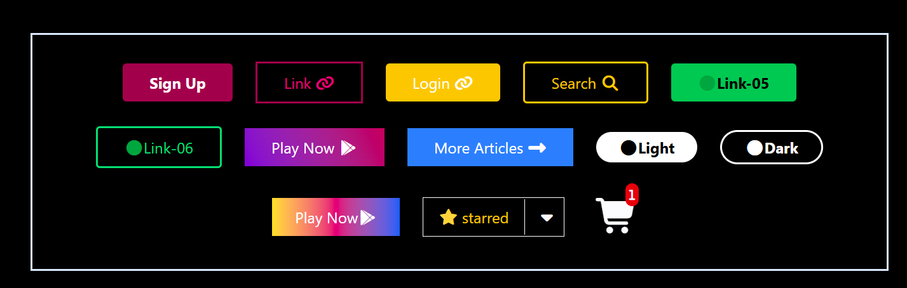

css project

Overview
This project demonstrates the use of Tailwind CSS, Font Awesome Icons, and basic HTML structure to create a visually appealing collection of styled buttons and icon components.
It serves as a front-end design practice for button variations, gradients, borders, hover effects, and responsive layouts.

Sample 

🧩 Features

🔘 Multiple button designs using Tailwind CSS utility classes

🎨 Variety of styles — solid, outlined, gradient, and rounded buttons

🖱️ Interactive hover effects for better user experience

💡 Light & Dark theme toggle button designs

🛒 Example of icon-based elements like cart, star, and dropdown

📱 Fully responsive layout using Flexbox and Tailwind utilities

🧰 Technologies Used

HTML5 – For structure and markup

Tailwind CSS (via CDN) – For modern utility-first styling

Font Awesome 7 – For vector icons and symbols

Responsive Design – Using flex, gap, min-h-screen, and justify-center

📂 Project Structure
project01/
│
├── index.html           # Main HTML file
└── README.md            # Documentation (this file)

🖋️ Code Highlights
1. Tailwind CDN Integration

This imports Tailwind CSS directly, allowing the use of Tailwind classes without a local setup.

2. Font Awesome Integration
<link rel="stylesheet" href="https://cdnjs.cloudflare.com/ajax/libs/font-awesome/7.0.1/css/all.min.css">

This enables the use of icons like 🔗, ⭐, 🛒, and 🎮 within buttons and UI components.

3. Example Button
<button class="bg-pink-800 rounded-sm px-7 text-white py-2 hover:bg-pink-700 font-bold">
  Sign Up
</button>

A pink button with rounded corners, hover color effect, and bold text.

🧠 Learning Outcomes

Mastery of Tailwind CSS button customization

Understanding of positioning and spacing utilities

Combining icons and text effectively

Building a simple yet aesthetic UI component gallery

